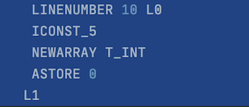
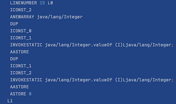

# Arrays

## Java
The facts that need to keep in mind:
- int[], or long[] are an array of primitive types, it is an object, so the elements are stored in `heap` other than stack.
- The size of each element of Array is the same. 
    - e.g. an int[], each element is 4 bytes. An Object[], each element is also the same, because the value of each element is NOT the object itself, it is the reference of object, they are always the same.
    
- Array is a fixed-size collection of items, same in Golang.
- Arrays.copyOf() actually call System.arraycopy() underneath, and then call native library to finish the operation

[Code Example](JavaArray.java)

## Kotlin

### Array and other xxArray

- Array is a class, which represent a Java array when running on JVM
- Kotlin also has specialized classes to represent arrays of primitive types without boxing overhead: `ByteArray, ShortArray, IntArray` and so on. These classes have no inheritance relation to the Array class

Decompiled Kotlin IntArray(5):

Decompiled Kotlin Array `arrayOf(1, 2)`:

[Code Example](KotlinArray.kt)

## Golang 

### Array
- Golang array is a `fixed-size` collection of items of the same type
- 0 is assigned to int array by default
- memory of an array is allocated once when it's created, because it's fixed. More efficient compare to Slice.

[Code example](main.go)

### Slice

## Questions:
[Best Time to Buy and Sell Stock II](https://leetcode.com/explore/featured/card/top-interview-questions-easy/92/array/564/) 

Say you have an array prices for which the ith element is the price of a given stock on day i.

Design an algorithm to find the maximum profit. You may complete as many transactions as you like (i.e., buy one and sell one share of the stock multiple times).

Note: You may not engage in multiple transactions at the same time (i.e., you must sell the stock before you buy again).

[Java solution](questions/stocksell/StockSell.java)

[Kotlin solution](questions/stocksell/StockSell.kt)

[Go solution](questions/stocksell/stocksell.go)

唉，同时写三个不同的语言，有点人格分裂……很有可能，一个月后我会分裂出 `Java 的我`， `Kotlin 的我`，和 `Go 的我`。